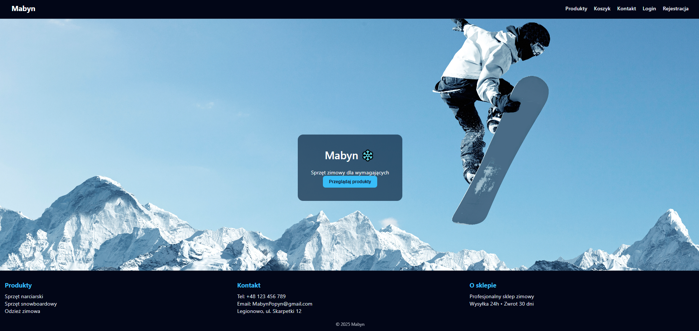
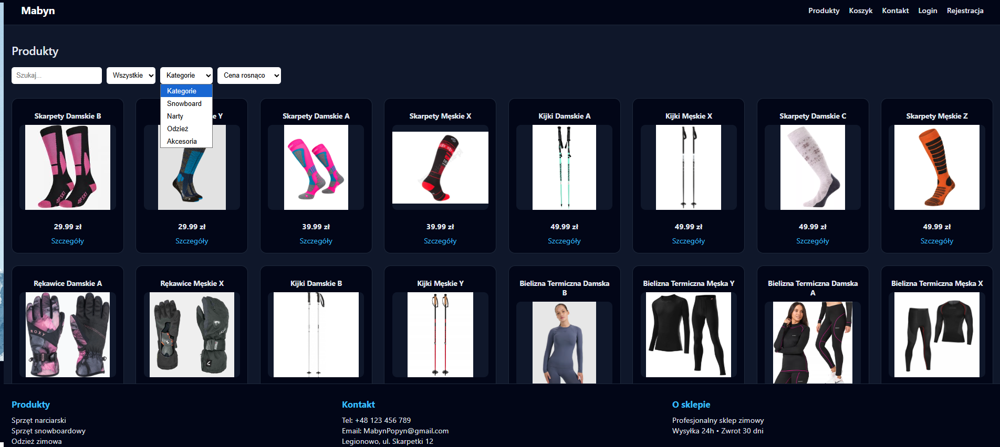
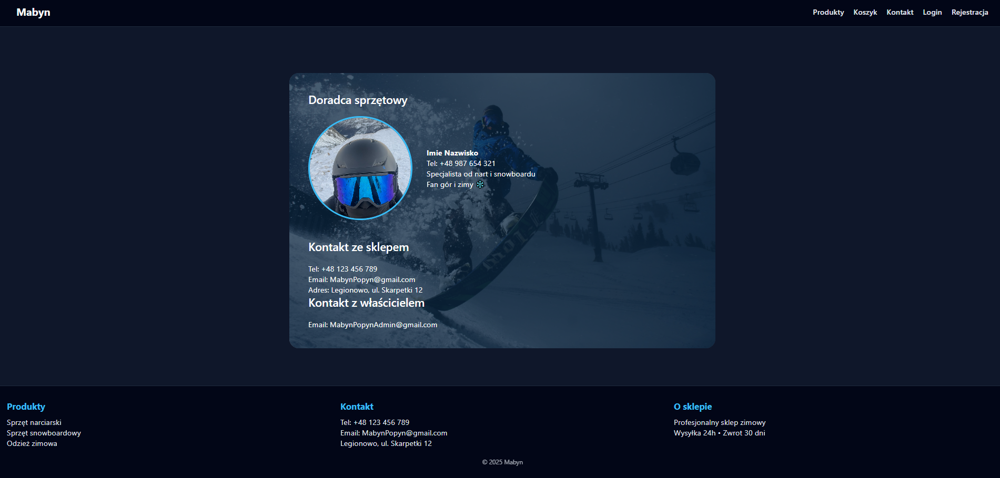

# ❄️ Ski Shop – Online Winter Sports Store

### Home


### Products


### Contact


An e-commerce web application for winter sports equipment, built with **React, PHP, and MySQL**.  
The project includes a full shopping experience: product browsing, cart management, order system, authentication, and an admin panel.

---

##  Features

###  User
- User registration and login  
- Browse available products  
- Filter products by category  
- Add products to cart  
- Remove products from cart  
- Place orders  

###  Order System
- Orders stored in the database  
- Order history available for admin  

###  Admin Panel
- Access to admin dashboard  
- View all user orders  

---

##  Tech Stack

**Frontend**
- React (Vite)

**Backend**
- PHP (REST API)

**Database**
- MySQL (XAMPP)

**Styling**
- CSS

---

##  Installation & Setup

### 1 Backend (XAMPP)

Copy the `backend` folder to:

xampp/htdocs/api


Then in xampp start:
- Apache  
- MySQL  

---

### 2 Database Setup

1. Open **phpMyAdmin**  
2. Create a database named:

skidb


3. Import the SQL file:


database/skidb.sql


---

### 3 Frontend

Navigate to the frontend folder and run:

```bash
cd frontend
npm install
npm run dev
```
 Test Account
Email: admin@example.com<br>
Password: admin
